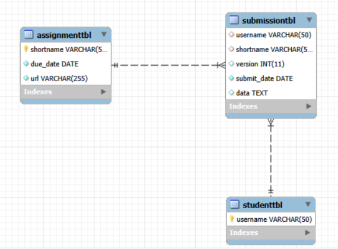

# Final Lab Task 2: Transforming ER into Relational Tables

## Create the student table:
- Define username as a VARCHAR(50)
- Set username as the Primary Key
## Create the assignment table:
- Define shortname as a VARCHAR(50) and set it as the Primary Key
- Define due_date as a DATE NOT NULL
- Define url as a VARCHAR(255), which can be null
## Create the submission table:
- Define username and shortname both as VARCHAR(50)
- Define version as an INT
- Define submit_date as a DATE NOT NULL
- Define data as TEXT
- Set a composite primary key of (username, shortname, version)
- Add foreign keys referencing the student and assignment tables
# Queries
- Student Table
 

- Assignment Table
 

- Submission Table
 

# Table Structure
- Student Table Structure

- Assignment Table Structure

- Submission Table Structure

# RELATIONAL SCHEMA

